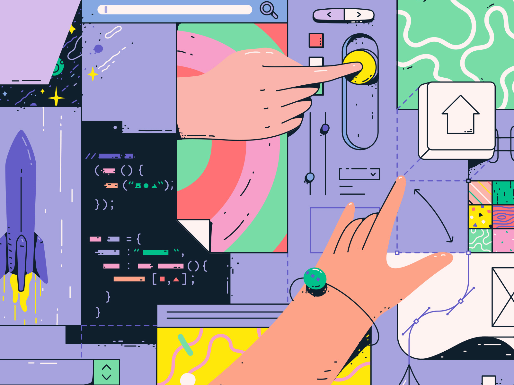
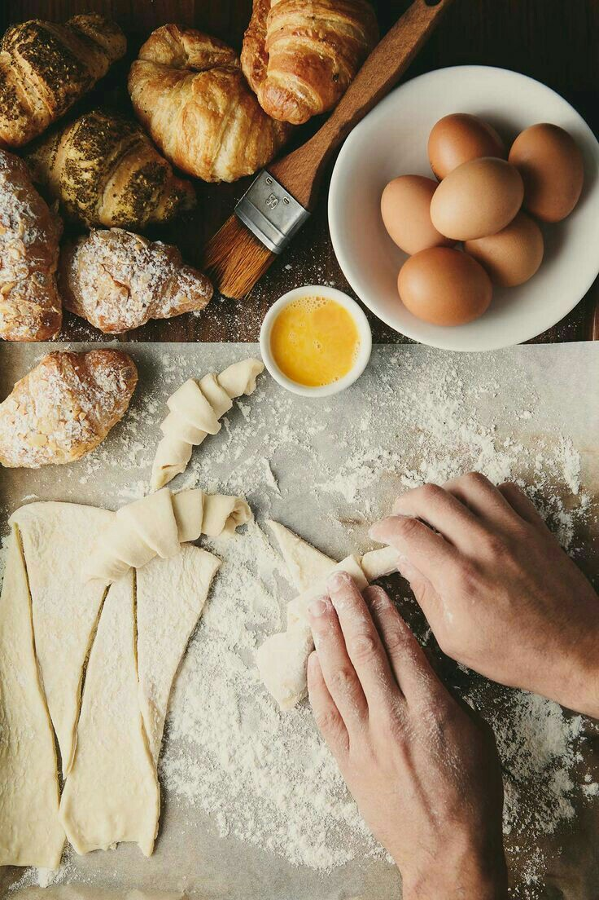
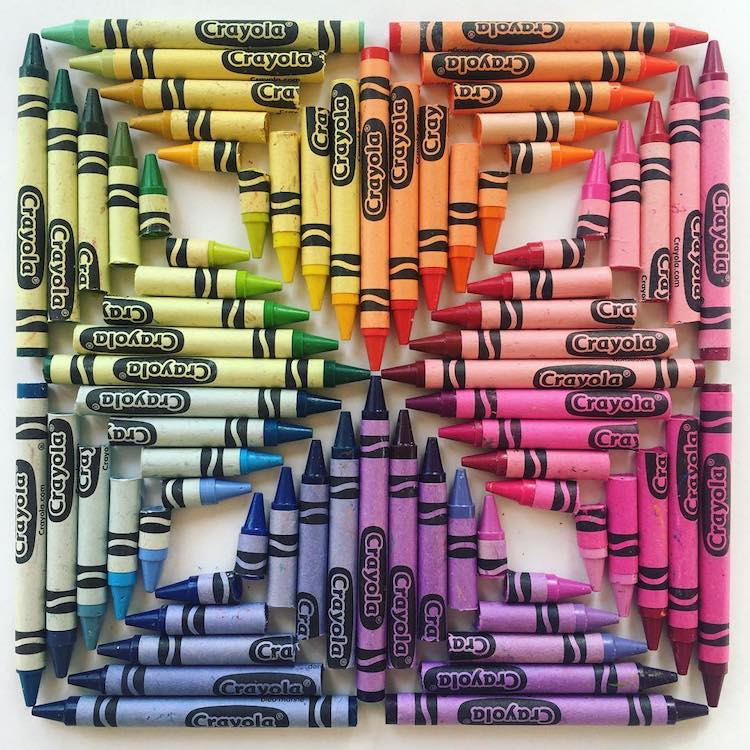

<h2>Quality Control</h2>

 Design in code is something that is criminally overlooked. Coding is such a technical field so it is easy to ignore the quality and the craftsmanship behind good code. There is a reason why it is a common interview question because the design quality is something that makes code and coders stand out. A design pattern is more than just how organized or efficient your code is, but it is a style altogether. The new generation is hungry for new and exciting technology and innovation, so I say we feed them. But before we start feeding all these people, we should first learn the craft of cooking... or in this case, coding.

<h2>The Secret Sauce</h2>

	Do you know the difference between a cook and a chef? A cook puts together ingredients, while a chef understands the food from the perspective of the eater. Code is incredibly similar to cooking. You have ingredients that you ensemble together, cook, and plate to make a dish. For convenience people will usually just get fast food or just eat things simply as they are. In contrast, people who enjoy cooking and eating fine dining know that there is more to it than just ingredients and heat. They have to craft the seasoning, form a taste profile, create complimenting flavors and textures. In the same way, good coders know that while efficiency and effectiveness are the most important, they also value the design of their code; the secret sauce. They value the plating of their code, the presentation, and the perspective of the user of said code. Something that will not only be good, but memorable.

<h2>Serenity in Synchrony</h2>

    We have all seen the likes of beautiful code, it flows smoothly, is organized, and uniform. These are all aspects for good code, but we must also keep in mind the user. Effective design is pleasant to look at, and optimal to edit and modify. We want to be as user friendly as possible and always imagine ourselves as the user and the consumer to most effectively meet our goals and create outstanding products. Implementing this methodology in our own code will greatly increase your appeal as a coder. This can start with something small as being consistent with your formatting, thinking outside of the box, and innovating constantly. Design is too important to be ignored.

