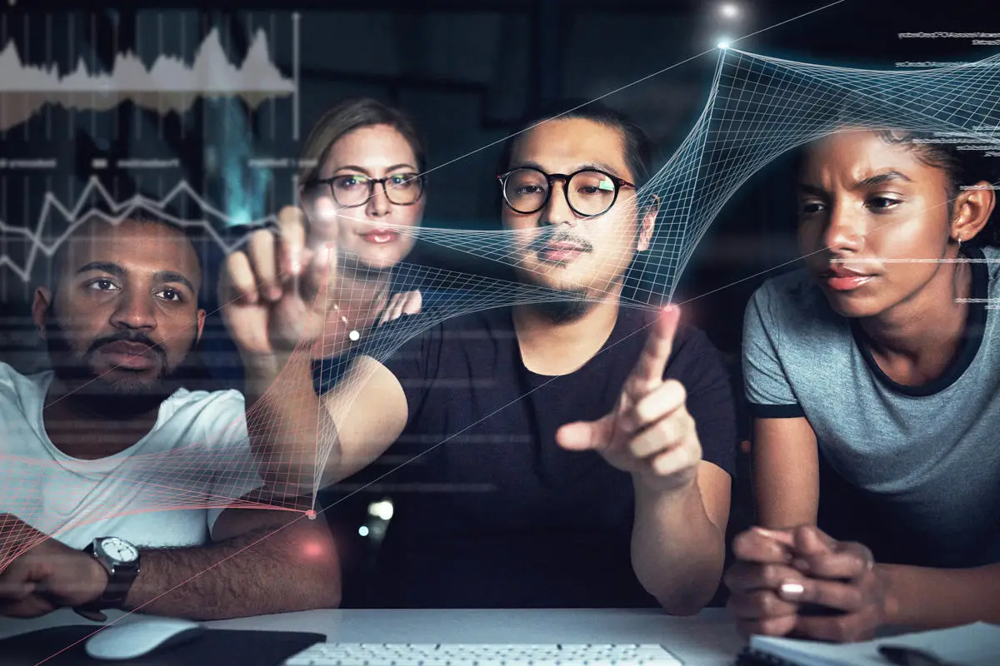
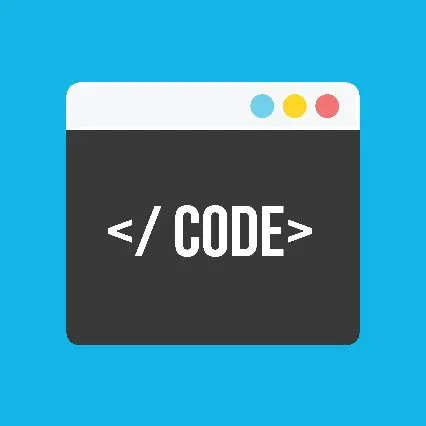
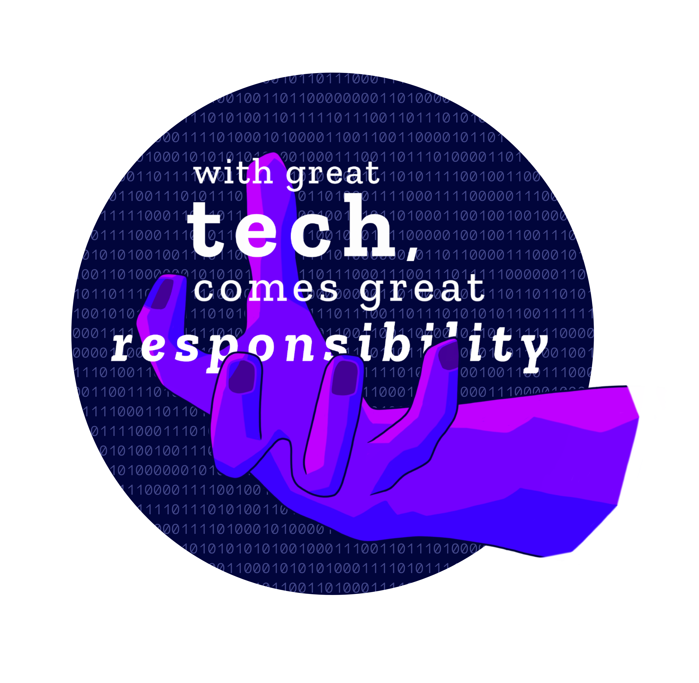

<h1>Did I learn anything?</h1>

Throughout my ventures in software engineering, I have learned that there is so much more to it than just coding and making websites. Those things are definitely pillars of the field, but to fully grasp the idea of software engineering, there has to be more consideration in aspects that may be more likely overlooked. Such things I have learned have definitely broadened my view on the field.

<h2>Collaborative Coding</h2>

  Why code by yourself when you can code with friends! Fun right? Not only is it fun, in some cases, but it is very crucial. You will almost always find yourself in a position where you are going to need to code with others, work off their progress, or plan out something among other contributors. In the grand world of coding, building off and working with each other is central. It seems like it's simple, but as always, working with people requires practice and quality. This is where participating in open source shines. Open source code is where multiple people can contribute to one project where they can edit, modify, or even improve each other' contributions. This is a huge part of software engineering because no singular man can code the world unless you are a super genius of course.

<h2>Keeping Your Room Clean and Bedsheets Tucked</h2>

  We know the importance of keeping your room tidy, especially those in the military where they stress uniformity and consistency. These are almost exactly the same values within software engineering. Something I learned that wasn't really stressed for me in the past was that coding should have standards. Of course, this also sounds simple, but going back to my previous topic of collaborative coding, we need to have an organized system of creating and sharing code. While your code is usually encouraged to be creative and outside of the box, we still want to avoid being too artistic in our execution because this can cause a lot of mess, confusion, and inconsistency. Code should almost be robotic in how it works, ironically enough. Similar to how we should tuck in our bedsheets, we should also not have trailing code phrases, or extra new lines when not needed, for example.

<h2>Technical, but Ethical</h2>

  Coding has a large application to our everyday life. Even in your pocket right now is a huge part of most of our life, the phone. Within the innovations are processes that involve our everyday life, actions, and our privacy. People value their privacy and safety, especially online. This being the case, enforcing ethically coding and software designing is very important. Something I debated recently was the ethicality of facial recognition. Some points we talked about were things like how the program may have a biased functionality towards white people over colored people, but also how it can be implemented in the justice system to help track down criminals. These points just show how complex the importance of ethics in coding is. As much as we can make programs or code that can do everything, we must also think and consider the human aspect as a creator and think about it from the viewpoint of users. This can stop a lot of legal trouble as well which saves money, time, and allows companies to focus on better things.

<h2> An Expansive World</h2>

It's big and it's a vast field of work. With that being said, the resources provided to excel are countless; online, piers, school, etc. While there is a lot to master and learn, it should not be something to intimidate. So many things go into making good code, good coders, and a good community of coding coders. The world is expanding lightning quick with new technology, inventions, and innovations and it's our job to keep up with it and contribute to a better tomorrow.

