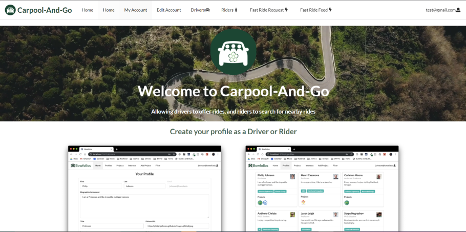

Within my final weeks in ICS314, a sophmore ICS class at UH Manoa, I developed a carpool website app with fellow classmates. Within this website we would collaborate in a milestone-like fashion. Over the course of about a month we were able to create a fully functional website where we can provide a communal network for University of Hawaii at Manoa, allowing for drivers to offer rides and for riders to be able to search for rides in their area.

My contribution was developing the edit profile functionality and the ground works for our user rating system. Both of these contributions dealt with modifying our object collections which we iniated for all users that would log in to the website. This information would be store in a json where it can be accessed, editted, or called on. All of these changes where mangaged through and issue-based format on our group github project page. While this was confusing and challenging at times, I still enjoyed developing this with my piers.

Here is what the page looks like 
  

You can check it out in full detail on [our website](https://carpool-and-go.github.io/).
