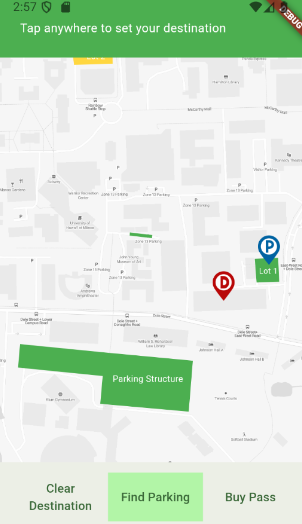

  
  

One of the many challenges during my time as a student was finding parking effectively. Lack of parking, or information on parking availability made me late to class too many times. Together with two partners, we designed an app using flutter to track and relay information to the user. We named it ParkUH.

ParkUH is an innovative mobile application designed to alleviate the challenges of parking at the University of Hawaii at Manoa. The app has real-time visual tracking of parking availability across campus parking zones and structures. Through a color-coded map, users can quickly identify which areas are full (red), moderately occupied (yellow), or have available stalls (green). ParkUH also integrates advanced features, such as destination-based recommendations and parking pass purchasing, to further streamline the user experience. By focusing on simplicity and efficiency, the app minimizes stress and wasted time for students, faculty, and staff commuting to campus.

Key functionalities include a “Find Parking” button for instant guidance to the most suitable zone and the ability to explore detailed information about specific lots, including historical congestion patterns and live data (via AI or hypothetical human reporting). While AI-driven stall detection using existing camera infrastructure was proposed, this feature remains in the conceptual phase due to logistical challenges. ParkUH’s user-first design ensures intuitive navigation, quick load times, and support for low-resource Android devices. Its minimalistic interface, combined with smart planning tools, positions it as an essential resource for improving the parking experience on campus.

Read more on my full documentation here -> [ParkUH.pdf](https://github.com/user-attachments/files/18554229/ParkUH.pdf)
