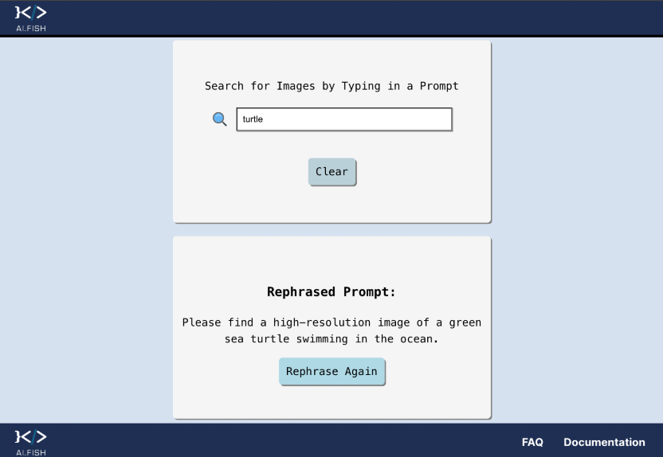

  

One of my most accomplished projects, me and two partners collaborated with Ai.Fish to develop a prompt rephraser that leverages AI-driven methods to locate protected species imagery. Hopefully this will help with longline fishing in protecting endangered species. The project’s goal was to integrate advanced APIs and user-friendly tools to streamline the search for marine species imagery. By working closely with Ai.Fish, a leader in computer vision technology with over 2 million annotated data points, we tailored our solution to enhance their database and improve fishing practices. This involved building a backend with Node.js to handle API calls, including ChatGPT for prompt rephrasing and Google’s Image API for retrieving relevant results.

  

Using React, we designed an interactive, user-friendly interface where users could input prompts, view rephrased suggestions, and access relevant images with metadata. We combined these features into a cohesive, functional webpage, ensuring smooth integration between the backend and frontend. Weekly meetings with Ai.Fish provided valuable feedback, helping us refine prompt engineering, improve efficiency, and resolve technical challenges. Through this partnership, we successfully delivered a robust package that integrates cutting-edge AI tools with practical, conservation-focused applications. Moving forward, the project lays the groundwork for additional features like location-based sorting, pagination, and duplicate prevention to further enhance usability.
